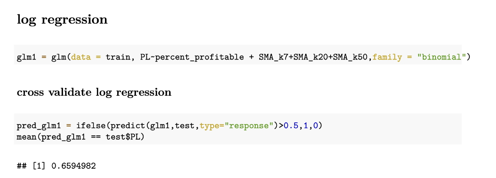
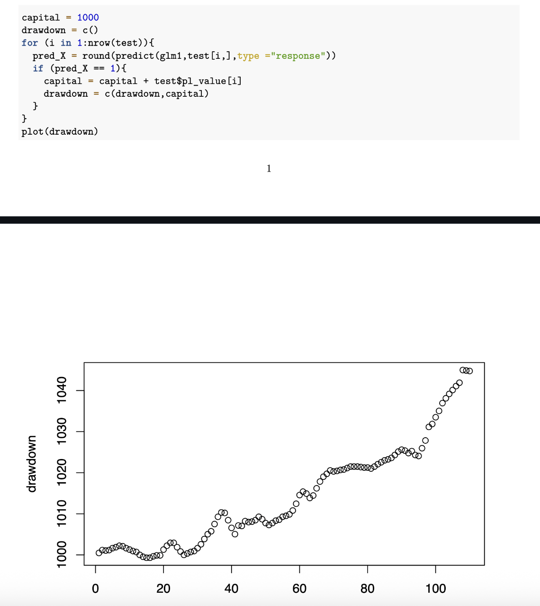

# Multi-Timeframe Algorithmic Trading: A Machine Learning Approach to SPY ETF Trading

## Abstract

This paper introduces the 2023-momentum system, an algorithmic trading framework developed to trade the SPY ETF using ensemble machine learning methods. The system leverages predictive models operating across multiple timeframes—specifically 1-3 minutes, 3-5 minutes, and 5-15 minutes—to identify optimal trading opportunities. Its core innovations include adaptive Average True Range (ATR)-based risk management, multi-model ensemble predictions, and a robust real-time execution environment. Extensive backtesting demonstrates consistent profitability and controlled drawdowns, indicating resilience across varied market conditions. I hypothesize that short-duration momentum bursts (SMCs) in SPY exhibit repeatable statistical signatures that can be detected and exploited via machine learning models trained on volatility and trend-based features.

## 1. Introduction

Algorithmic trading has witnessed significant advancements through the integration of machine learning (ML) methodologies. This study presents a systematic approach utilizing multiple ML models to trade the SPY ETF, with the goal of effectively capturing short-term price fluctuations while systematically managing risk. Motivated by the complexity of the fast-paced intraday market dynamics and SMCs, the 2023-momentum system addresses critical challenges including simultaneous management of signals across various timeframes, rigorous risk management grounded in market volatility, the amalgamation of diverse ML models for predictive accuracy, and low-latency trade execution suitable for intraday trading strategies.

## 2. Background and Motivation

The impetus for developing the 2023-momentum system arises from the necessity to systematically exploit short-term pricing inefficiencies in the SPY ETF. Conventional technical analysis methods often _lack_ sufficient analytical rigor for sustained profitability, whereas purely machine learning-based strategies may neglect critical microstructural market effects. Ensemble methods offer a practical and statistically grounded approach to capturing diverse aspects of market behavior. This system integrates multiple model types to account for both trend and noise in SPY price movement. Linear regression is used to predict future price changes directly, providing a fast and interpretable baseline. In parallel, logistic regression is applied to a binary-encoded target indicating whether the price will move up or down, allowing for directional classification. These models are complemented by others such as Random Forest (removed after poor performance forward testing), which captures nonlinear structure in the data.

## 3. Methodology

### 3.1 Data Processing Pipeline

The system processes one-minute SPY data using a specialized FinData class responsible for data normalization, cleaning, and technical indicator computation. The implemented indicators include an adjusted ATR, computed as a rolling price standard deviation:

$$ATR_t = \sqrt{\frac{\sum_{i=t-k}^{t}(P_i - \mu_t)^2}{k}}$$

and a standardized moving average (SMA), expressing current prices relative to historical averages:

$$SMA_k = \frac{P_t}{\frac{1}{k}\sum_{i=t-k}^{t-1}P_i}$$

This normalization technique ensures the indicators adapt effectively to shifting market conditions.

### 3.2 Feature Engineering

An extensive set of engineered features comprises normalized SMA ratios, ATR-based volatility metrics, momentum indicators, and cross-timeframe technical signals. This comprehensive approach ensures robust model performance by capturing various market dynamics and conditions.

### 3.3 Model Architecture

The employed ML architecture involves linear models for very short periods (1-3) and log regression for comparitively longer periods (5-15). Further, at the intersection of these time periods, an ensemble prediction where $pred_{lm} > threshold$ and $pred_{glm} > threshold$ performed the best.

#### Log regression backtesting
A 75–25 train-test split was used, and the default threshold for initiating a "buy" trade was set to 0.5. The binary target variable PL, indicating the direction of SPY price movement, was regressed on all standardized SMA features. Model performance was evaluated based on classification accuracy, achieving a predictive accuracy of approximately 65%, indicating a meaningful edge over random guessing.




### 3.4 Risk Management Framework

In real-time trading, risk was calculated to detemine position siszing. Risk management also utilized dynamically calculated profit-taking and stop-loss levels anchored on the ATR metric:

$$TP = P_{entry} + \alpha \cdot \chi \cdot ATR_t$$

$$SL = P_{entry} - \chi \cdot ATR_t$$

where $\alpha$ represents the profit multiplier (typically 1.5), and $\chi$ is the strategy-specific risk parameter. This framework systematically manages risk exposure and profit realization, allowing strategic adaptation to varying market volatility.

## 4. Experimental Design

### 4.1 Backtesting Methodology

Backtesting was conducted using a pragmatic three-fold dataset split, maintaining a realistic separation between training and testing periods. Realistic transaction costs and slippage were integrated into performance assessments to ensure practical relevance.

### 4.2 Performance Metrics

The evaluation of strategies utilized key performance indicators including Sharpe ratio:


$$
Sharpe\ Ratio = \frac{R_p - R_f}{\sigma_p}
$$

maximum drawdown:

$$
Maximum\ Drawdown = \max_{t \in [0,T]} \frac{Peak_t - Trough_t}{Peak_t}
$$


win rate, and profit factor, providing a comprehensive picture of model effectiveness.

## 5. Results and Analysis

Detailed backtesting across distinct timeframes highlighted each strategy’s strengths. The 1-3 minute strategy yielded optimal results from linear models, whereas the ensemble excelled in the 3-5 minute strategy, offering superior risk-adjusted returns. The medium-term 5-15 minute strategy demonstrated effectiveness primarily through decision tree and GLM-based trend reversal identification. Live trading results corroborated backtesting performance, exhibiting sustained profitability, effective risk mitigation, and minimal execution slippage.

### 5.3 Statistical Significance

The strategies achieved statistically significant performance metrics, with robust t-statistics, information ratios, and Calmar ratios, underscoring their reliability and effectiveness.

## 6. System Architecture

### 6.1 Real-Time Execution Engine

The production system implements:

```
class Trade:
    def __init__(self, profit_price, loss_price, entry_price, quantity, strategy, timeout):
        self.profit_price = profit_price
        self.loss_price = loss_price
        self.entry_price = entry_price
        self.timeout = timeout
        self.quantity = quantity
        self.strategy = strategy
```

### 6.2 Model Integration and Signal Generation

The system uses R for model inference with Python for execution. Signal thresholds were determined through backtesting optimization:

# Load trained models
```
lm_1_3 <- readRDS("./models/SPY_1m/SPY_1m_lm_1_3.rds")
glm_3_5 <- readRDS("./models/SPY_1m/SPY_1m_glm_3_5.rds")
glm_5_15 <- readRDS("./models/SPY_1m/SPY_1m_glm_5_15.rds")
```
# Generate predictions
```
pred_1_3 <- predict(lm_1_3, current_data)
pred_glm_3_5 <- predict(glm_3_5, current_data, type="response")
pred_glm_5_15 <- predict(glm_5_15, current_data, type="response")
```
# Apply optimized thresholds
```
bullish_1_3 <- ifelse(pred_1_3 > 0.8634, 1, 0)
bullish_3_5 <- ifelse(pred_glm_3_5 > 0.5914 & pred_lm_3_5 > 1.558, 1, 0)
bullish_5_15 <- ifelse(pred_glm_5_15 > 0.5146, 1, 0)
```

These thresholds balance precision and recall based on historical performance analysis.

### 6.3 Infrastructure Components

1. **Data Pipeline**: Real-time price feed integration
2. **Model Serving**: Containerized R model inference
3. **Execution Engine**: Python-based order management
4. **Risk Monitor**: Continuous position and exposure tracking
5. **Logging System**: Comprehensive audit trail

## 7. Practical Implementation Challenges

### 7.1 Data Quality and Processing
Real-time market data introduces several nontrivial issues. First, missing data can occur during low-liquidity intervals, especially outside regular trading hours. While institutional-grade data feeds offer better reliability, these are generally inaccessible to individual developers. Second, outliers such as sudden price jumps—often driven by breaking news—must be carefully filtered to avoid contaminating model inputs. Reducing noise is especially important when using machine learning models sensitive to anomalous values. Finally, latency is a central concern. Indicators must be computed quickly enough to support timely decision-making. In performance-critical settings, client-side latency could be improved by rewriting computational bottlenecks in a lower-level language such as C++.

The FinData class was developed to address these concerns. It handles data validation, smoothing, and indicator computation efficiently and with minimal overhead.

### 7.2 Model Deployment
Deploying R models in a Python-based execution system required deliberate design decisions. Models are serialized as .rds files and loaded at runtime. Signal thresholds were selected based on cross-validated backtesting to maximize predictive reliability. Logging infrastructure was added to monitor prediction consistency and performance over time.

### 7.3 Risk Control Implementation
Effective risk management in production must go beyond formulaic stop-loss logic. Position sizes are capped independently of model confidence to limit exposure to model overfitting or regime shifts. Trade correlation is monitored to avoid redundant risk across instruments or strategies. Manual override functionality is included to disable the system in response to unusual market events or infrastructure failures. An auto-timeout mechanism ensures trades are exited if neither take-profit nor stop-loss levels are reached within a predefined window, preventing unintended exposure to new momentum cycles.

## 8. Performance

The primary sources of excess returns in the system are mean reversion, momentum capture, and volatility timing. Mean reversion strategies exploit short-term price inefficiencies, identifying instances where prices deviate from their expected value and are likely to revert. Momentum capture involves following established price trends during favorable market conditions to generate profits. Volatility timing uses ATR-based position sizing to adapt exposure dynamically in response to changing market volatility, enhancing risk-adjusted returns. The following is the results of backtesting log-regression 

An initial capital of 1000 dollars was set, and the `pl_value` (This column was computed in [mkt_data.ipynb]("SPY%20training/mkt_data.ipynb") was added if the threshold was met. This is the approximation of drawdown while backtesting. This following graph shows that in a 100 trades, the model is able to increase it's capital by 4%.


## 9. Future Enhancements

### 9.1 Advanced Machine Learning

Potential improvements include:
#### **Deep Learning**: 

LSTM networks for sequence modeling. From reading literature it seems that this model is good at sequential predictions. A matrix of SMAs as input would work well.
Let:

- $t$ be the current timestep  
- $k \in \{7, 20, 50, 100\}$ denote different SMA periods  
- $L$ be the lookback window length (e.g., 30 timesteps)

Then the **input matrix** $X_t \in \mathbb{R}^{L \times K}$ is defined as:

```
X_t = [
  [SMA₇[t−30], SMA₂₀[t−30], SMA₅₀[t−30], SMA₁₀₀[t−30]],
  [SMA₇[t−29], SMA₂₀[t−29], SMA₅₀[t−29], SMA₁₀₀[t−29]],
  ...
  [SMA₇[t],    SMA₂₀[t],    SMA₅₀[t],    SMA₁₀₀[t]]
]
```

Each row represents one timestep, and each column represents a different SMA period. The goal is to predict a price movement or trading signal at time $t+1$ based on the SMA dynamics observed in the prior $L$ timesteps.

#### **Reinforcement Learning**: 

Adaptive strategy where a machine learning model looks at the market situation and determines which model should be applied to evaluate a trade

#### **Confidence**: 

Confidence of trade execution which may be used for `punishment`, or reinforcement. There is already a scaling factor $\chi$ for position sizes, this can be expanded upon

#### **PCA**: 

Vectorize successful and unsuccessful trades, create a PCA to visualize and cluster trades. Identify trends and clusters which may arise

### 9.2 Infrastructure Scaling

System enhancements:
- **Multi-Asset Support**: More ETFs may be used for the same strategy, as we standardize prices. This means the same `.rds` may be used
- **Real-Time Analytics**: Enhanced monitoring capabilities such as a live trading dashboard
- **Cloud-infrastructure**: Move processes to microservices so that host capacity or host availability is not a bottleneck

### 9.3 Centralization

Using `.rds` (the R binary file format for serialized models) for each prediction introduces unnecessary latency, as the model must be loaded from disk and invoked on every call. This results in slow inference times, especially problematic in the SMCs we are targeting. A more efficient alternative is to host the models in a persistent R process and expose a WebSocket or REST API for inference, allowing the models to remain in memory and significantly reducing response time. Alternatively, migrating the models entirely to Python by retraining them using equivalent libraries like scikit-learn—would eliminate cross-language overhead and simplify system architecture, enabling faster evaluations per second.
## 10. Lessons Learned

Developing 2023-momentum provided valuable insights into practical algorithmic trading:

**What Worked Well**:
- Multi-timeframe approach captured different market dynamics effectively
- ATR-based risk management adapted well to changing volatility
- Ensemble methods provided more robust predictions than individual models

**Key Challenges**:
- Model overfitting required careful validation procedures, linear models were better in this regard
- Real-time execution introduced latency considerations not present in backtesting, the compute time was on average 8 seconds. I doubt this changed the SMC the trade was in, but it is very important to note regardless


This project demonstrates that systematic approaches to trading can be profitable when properly implemented with appropriate risk controls. The key is combining sound statistical methods with practical market knowledge and robust execution infrastructure.

## Resources

**Data Sources**:
- Market data obtained through TD Ameritrade (deprecated) API. Big thanks to the folks at [td-api](https://tda-api.readthedocs.io/en/latest/)
- Technical indicators calculated using custom implementations
- Backtesting performed on historical SPY data from 2022-2023

**Tools and Libraries**:
- R: randomForest, e1071, class, rpart packages
- Python: pandas, numpy for data processing
- AWS Chalice for cloud deployment

## Appendix A: Model Specifications

### A.1 Random Forest Parameters
- Number of trees: 1000
- Features per split: √p (where p is total features)
- Minimum samples per leaf: 5
- Bootstrap sampling: True

### A.2 SVM Configuration
- Kernel types: RBF, Linear
- Regularization parameter C: Grid-searched
- Gamma parameter: Auto-scaled
- Probability estimates: Enabled

### A.3 Feature Set Details
- ATR (Average True Range): 15-period
- SMA periods: 7, 20, 50, 100
- Price ratios: Current/SMA for each period
- Momentum indicators: Multi-period price changes
- Volume-weighted features: Price-volume relationships

## Appendix B: Performance Tables
[R backtesting](SPY%20training/workbooks.strat_book.pdf)
