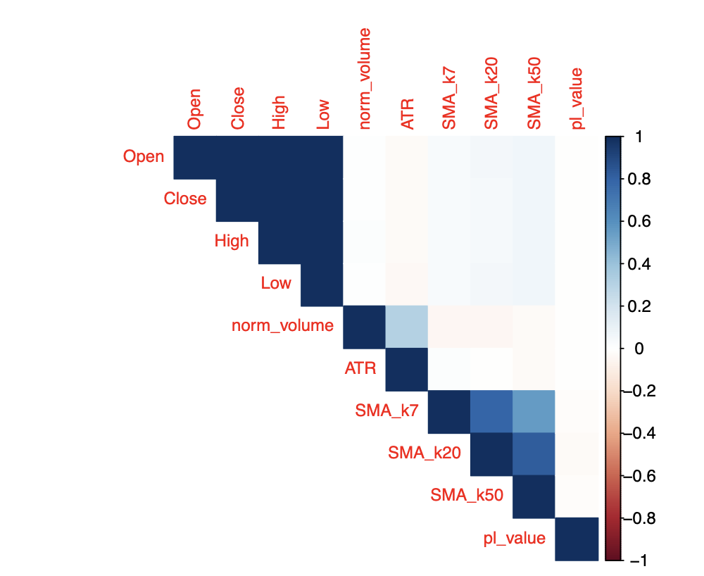
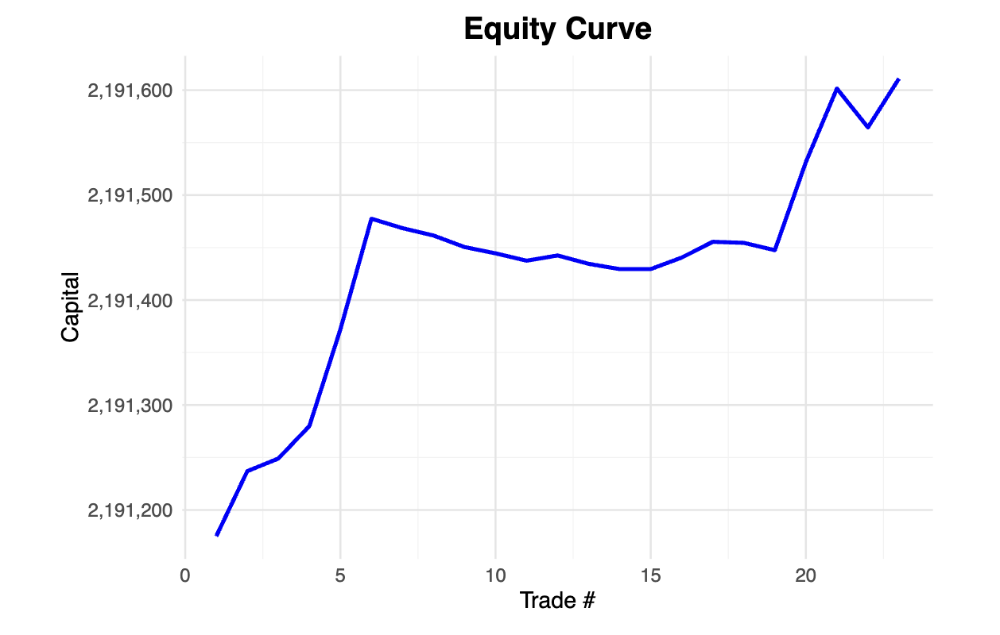
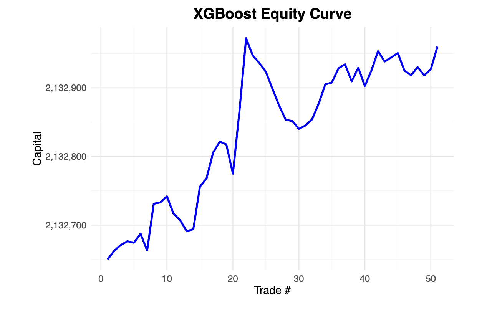
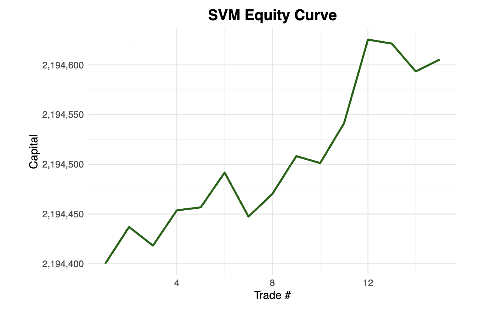
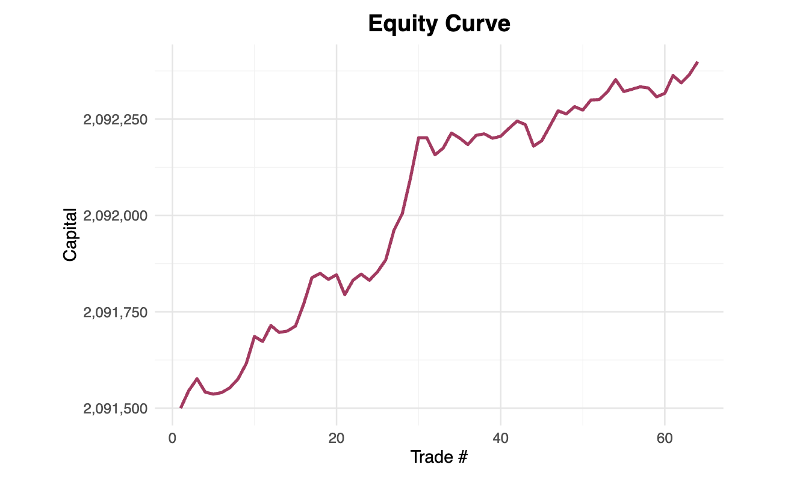

# Machine Learning-Driven Algorithmic Trading Strategy for SPY ETF

**Author:** Ayan Goswami  
**Date:** July 16, 2025

# Abstract

This paper presents a machine learning framework for intraday trading of the SPDR S&P 500 ETF (SPY) using standardized formats of traditional indicators. The strategies leverage Average True Range (ATR), Moving Averages, and Volume to try and predict short term momentum bursts (MBs). We employ logistic regression, XGBoost, and support vector machines (SVM) to predict this, and this paper will focus on long-only strategies as they are less risky when implementing in a production environment. Emphasis is placed on high precision and minimizing false positives using probabilistic thresholds derived from model outputs. Backtests demonstrate that our methods significantly outperform random chance in terms of Sharpe ratio, precision, and drawdown control.

Keywords: Support Vector Machines, Gradient

# Introduction

The development of statistically sound and precision driven trading strategies is essential in modern algorithmic finance. This paper addresses the problem of directional prediction of SPY ETF trades using machine learning and statistical modeling by transforming traditional day trading indicators. We aim to optimize execution precision rather than naive accuracy, focusing on reducing false positive trade signals. This is done through increasing machine learning output categorization thresholds, at the cost of missing profitable trades (false negative).

# Data and Features
The dataset comprises one minute interval price data (OHLCV: Open, High, Low, Close, Volume) for the SPDR S&P 500 ETF Trust (SPY) spanning from May 29th, 2023, to July 17th, 2023 with 21493 candles. From these primary market data points, we derived a set of technical indicators commonly employed in financial analysis. While these indicators typically involve parameterization, we adopted industry standard parameters to maintain methodological consistency and prevent overfitting through excessive parameter optimization. This research focuses primarily on optimizing machine learning models' predictive capabilities using these established indicators, rather than engaging in indicator parameter optimization. This approach allows us to isolate the effectiveness of various machine learning architectures while maintaining the integrity of widely accepted technical analysis frameworks.

## Timeout (t)
There is no right way to time price trends, hence the best path forward to specialize in different time frames is to set an automatic timeout for trades. This way we categorize different types of momentum bursts based on their time period, and each strategy occupies its own seperate area of specialization. Thus, we introduce 5 primary timeout periods for this paper:
1. 3 minutes
2. 5 minutes
3. 15 minutes
4. 60 minutes
5. 180 minutes

## ATR (volatility measure)

ATR (Average true range) is a technical indicator that measures market volatility by decomposing the entire range of an asset's price for a given period. Developed by J. Welles Wilder, it's calculated using the previous price movements of the security. For the purpose of our analysis, it was calculated using standard deviation.

$$ ATR_T = \sqrt{\frac{\sum_{i=T-k}^{T}(OHLC_i - \mu_T)^2}{k}} $$ 


Where $OHLC = \frac{Open+High+Low+Close}{4}$ and $k$ is the look back period. The look back period standard in the industry is 14, and we set this as our look back period as well.

The motivation was to control
the sensitivity to market volatility and potentially use as a regressor. The purpose is that it scales profit/loss targets based on current market conditions

During the data mining process, we introduced an ATR scaling factor $\lambda$ which uses ATR to increase profit and loss margins. 
- **Example**: If SPY ATR = 0.50 and $\lambda = 10$:
    - Base volatility adjustment = 10 × 0.50 = \$5.00
    - Hypothetically: Sell if SPY is up 5$ from entry price

For longer time periods, the price might fluctuate a lot more than shorter time frames. In order to prevent being stopped out of a potentially profitable but volatile trade, the bounds for profit and loss are set a lot higher in trading windows with higher timeouts. In order to determine what the multiplier should be for the defined timeouts we implement a logarithmic scaling function that increases position bounds proportionally to the trading window duration.

The relationship between timeframe and volatility follows a logarithmic pattern, where:

$$\lambda = 4\log(t-2)+1$$

Hence the relationships for each timeout are as follows:

1. 3 minutes $t$ => $\lambda = 1$
1. 5 minutes $t$ => $\lambda = 3$
1. 15 minutes $t$ => $\lambda = 5$
1. 60 minutes $t$ => $\lambda = 8$
1. 180 minutes $t$ => $\lambda = 10$

Furthermore, we introduced an asymmetric risk-ratio ($\chi$) which determines how much higher the take profit price will be compared to the stop loss, for a given $\lambda$. For simplicity though, this was fixed to 1.5. Further exploration can be conducted to fine tune this parameter

Our `pl_value` column was determined by a 100 shares of SPY, where the targets were:
- **Profit Target** $PT$: $Price + \lambda * \chi × ATR$

- **Loss Target** $LT$: $Price - \lambda * ATR$

For each entry point $i$, the algorithm checks future prices within time window $t$ minutes. This is done pessimistically, where the stop loss is evaluated first:
Stop Loss Check:
```
if Low_{i+j} ≤ Loss_target:
    PL = 0  # Loss trade
    pl_value = (Loss_target - Open_i) × 100
where:
Loss_target = Open_i - (λ × ATR_i)
j ∈ [0, t]
```

Take Profit Check:
```
if High_{i+j} ≥ Profit_target:
    PL = 1  # Winning trade
    pl_value = (Profit_target - Open_i) × 100
where:
Profit_target = Open_i + (λ × ATR_i)
j ∈ [0, t]
```
Time Expiry:
```
if j = t and no target hit:
    pl_value = (Close_{i+t} - Open_i) × 100
```
The `PL` column was used for encoding a binary win/lose variable for the machine learning models, and `pl_value `was used to determine drawdown.

## Standardized Moving Average

Moving averages are fundamental to technical analysis, serving as trend-following indicators by smoothing price data over specified periods. We standardize these indicators by comparing the current opening price to the historical average closing price, using the formula:

$$SMA_k = \frac{Open_T}{\frac{1}{k}\sum_{i=T-k}^{T-1}Close_i}$$

where $T$ represents the current time period and $k$ is the lookback period. This standardization creates a ratio where values above 1.0 suggest bullish conditions (current price exceeds historical average), while values below 1.0 indicate bearish conditions (current price below historical average). For our analysis, we selected three key lookback periods:
1. 7
2. 20
3. 50 
This represents short, medium, and long term trends respectively. To capture the interplay between different time horizons that traders often consider, we incorporated interaction terms between these moving averages in our models.


## Normalized trading volume

We normalized the trading volume to address the highly volatile nature of SPY intra-day market activity. Using z-score standardization, we transformed the raw volume data by subtracting the mean volume and dividing by the standard deviation: $(volume - \mu_{volume})/\sigma_{volume}$. This standardization centers the volume data around zero and scales it by its variability, creating a dimensionless measure where values typically fall within three standard deviations of the mean. The transformation effectively reduces the impact of extreme volume spikes while preserving the relative relationships in the data. This normalization step is crucial for our regression analysis as it helps stabilize the coefficients and reduces the influence of outliers that could otherwise distort our results.

# Methodology

Our study prioritized model precision to minimize false positives in trading signals, as these can lead to significant financial losses. We selected three complementary models: logistic regression, XGBoost, and Support Vector Machines (SVM) with a radial kernel. Logistic regression serves as an interpretable baseline, while XGBoost excels at capturing non linear feature interactions and handling imbalanced financial data through its gradient boosting framework. The SVM with a radial kernel function (RBF) was chosen for its ability to find complex decision boundaries in high-dimensional space while being less prone to overfitting compared to linear kernels. While no model inherently guarantees high precision, we enhanced their performance through threshold optimization, allowing us to adjust the trade-off between precision and recall based on our risk tolerance. This approach enables us to reduce false positives, which is crucial for practical trading applications. For simplicity, this paper will focus on the results of the smallest timeout (3 minutes). The p value used for determining validity is 0.05. The train-test split was 75-25, so our model was trained on 16119 observations. 

The following are the metrics of evaluating the model.

- **Sharpe Ratio**: Mean return over return standard deviation
- **Precision**: $TP / (TP + FP)$
- **Max Drawdown**: Largest capital loss from peak
- **Returns**: Percentage increase in capital

## Baseline: Random Trading Simulation
To ensure that the observed model performance was not an artifact of upward trending data or survivorship bias, we established a benchmark using a random trading strategy. A "coin-toss" trader was simulated by randomly deciding whether to take each trade, independent of market features. This simulation was run 100 times with different seeds, each time using a fresh draw from the test set and computing the resulting capital trajectory.

For each run, we recorded both the precision (fraction of trades that resulted in profit) and the percentage return. The simulations yielded a distribution of outcomes representing what could be achieved through pure chance.

Using a normal approximation, we computed the 95th percentile lower bound for both metrics:

- (Lower bound) Precision: 0.455
- (Lower bound) Return: 0.046%
- (Lower bound) Sharpe: 0.02511618
- (Upper bound) Max drawdown: -0.05253197%

These values serve as statistical baselines: any strategy whose performance fails to exceed them cannot be considered reliably better than random chance at the 5% significance level. All predictive models were evaluated with respect to this baseline to establish their real-world utility.

## Logistic Regression

The logistic regression model estimates the probability of profitable trades by modeling the log-odds as a linear function of predictors:

$$ \log\left(\frac{p}{1-p}\right) = \beta_0 + \beta_1 X_1 + \cdots + \beta_k X_k $$

Where p represents the probability of a profitable trade and X_i are the predictor variables.
Initially, all regressors the three moving averages ($SMA_{7}$, $SMA_{20}$, $SMA_{50}$), normalized volume, and ATR  were included in a logistic regression model, along with all possible interaction terms up to the fourth order. This resulted in a model with 126 terms. However, only a small subset of coefficients were statistically significant based on their p-values, and diagnostic plots revealed strong multicollinearity among the SMA features.



To quantify the multicollinearity, we calculated the Variance Inflation Factor (VIF) using a linear regression model with pl_value as the dependent variable. The VIF for $SMA_{20}$ exceeded the conventional threshold of 5, indicating substantial collinearity with the other predictors. As a result, $SMA_{20}$ was excluded from subsequent models to improve stability and interpretability. This threshold aligns with guidance in regression diagnostics literature (see James et al., 2021);

Variable selection was conducted using both stepwise selection based on the Akaike Information Criterion (AIC) and Lasso regularization. These methods were employed to reduce model complexity and mitigate multicollinearity, particularly among the interaction terms. The AIC approach iteratively added or removed predictors to minimize information loss, while the Lasso imposed an $L_1$ penalty to shrink less informative coefficients toward zero.

Cross-validation was used to evaluate generalization performance, and both a full interaction model and a more conservative (sparser) Lasso-selected model were fit. When comparing predictive accuracy on the test set, the two models performed similarly. As a result, model selection was adaptive: the final model chosen at inference time would alternate between the full and conservative model, depending on their respective validation performance.

Since  we prioritized precision, defined as the ratio of true positives to all predicted positives, over raw classification accuracy we had to identify a suitable threshold. We explored a range of high quantile cutoffs from the model’s fitted probability distribution. Specifically, we evaluated thresholds corresponding to tail probabilities ranging from 
$10^{-2}$ to $10^{-8}$ incrementally filtering for only the most confident predictions. For each threshold, we calculated the number of true positives, false positives, and the resulting precision. If the number of predicted positives was fewer than 30, the iteration was terminated early, in accordance with guidance from Agresti (2013) that at least 10 successes and 10 failures are necessary for reliable normal approximation of a binomial proportion.

The winrate, used as a proxy for precision in this context, peaked at 56.6 percent when using a threshold corresponding to the 
$10^{-6}$ upper quantile of predicted probabilities. This outcome confirms that tighter thresholds can substantially improve precision, though at the cost of reduced trading frequency. This threshold was `0.577`.


## XGBoost

XGBoost, which stands for eXtreme Gradient Boosting, is a machine learning algorithm that utilizes a gradient boosting framework to build predictive models. It's known for its scalability, performance, and ability to handle complex datasets, often outperforming other gradient boosting implementations. The XGBoost algorithm was implemented to maximize area under the precision-recall curve (AUC-PR), reflecting our emphasis on precision over recall in the trading context. The model optimizes the objective:

$$ L(\phi) = \sum_{i=1}^n l(y_i, \hat{y}i) + \sum{k=1}^K \Omega(f_k) $$

where l is the loss function, $\hat{y}_i$ are predicted probabilities, and $\Omega$ represents regularization terms controlling model complexity. 

Similar to the logistic regression approach, we applied threshold tuning to this model’s probabilistic outputs in order to maximize precision. Rather than using a fixed decision threshold of 0.5, we evaluated multiple upper quantiles of the predicted probability distribution to identify the cutoff that minimized false positives. The model was trained using all two way and higher-order interaction terms among the predictors, allowing it to capture complex nonlinear relationships in the data. The highest precision achieved was 76.65% at a threshold of `0.555`, indicating that trade signals above this level could be more reliable.

## Support Vector Machines

We employed Support Vector Machines with radial basis function (RBF) kernels to detect potentially non-linear decision boundaries. The RBF kernel function:

$$ K(\mathbf{x}_i, \mathbf{x}_j) = \exp(-\gamma ||\mathbf{x}_i - \mathbf{x}_j||^2) $$

The RBF kernel implicitly maps the input features into an infinite dimensional space, enabling the model to construct flexible decision boundaries without requiring explicit feature engineering. This approach is well-suited for financial applications, where interactions between technical indicators are often nonlinear and context-dependent. The RBF kernel is widely regarded for its ability to generalize well in high dimensional settings (Vapnik, 1995). 

Probability calibration and threshold optimization were performed analogously to the GLM and XGBoost approaches. By scanning upper quantiles of the model’s predicted probability distribution from the training data predicted values, we identified an optimal decision threshold that prioritized precision. The highest precision achieved by the SVM model was 79.55% at a threshold of `0.612`.


# Results (Backtesting trading simulation)

The models were evaluated using precision metrics and backtested on out-of-sample data to assess real-world trading performance. We applied each model's optimized decision threshold to a trading simulation to evaluate real-world performance. The simulated trader began with a portfolio sized such that purchasing 100 shares of SPY would represent only 2% of the total capital, reflecting standard risk management practices that recommend limiting position size to 1-2% of capital per trade (Elder, 2002). At each opportunity, if the model's predicted probability exceeded the tuned threshold, the simulated profit or loss (pl_value) was added to the cumulative capital. This process produced a full equity curve for each model, from which we derived key performance metrics described in the methodology section, including return, Sharpe ratio, and maximum drawdown.

The ensemble prediction strategy applied the default threshold of 0.5 across all three models, as the optimized thresholds differed significantly and did not exhibit sufficient alignment to justify a unified criterion.


| Model | Sharpe | Max Drawdown | Precision | Returns |
|-------|--------|---------------|-----------|-------|
| GLM | 11.129 | -0.019% | 50% | 0.019% |
| XGBoost | 10.59823 | -0.01 % | 58% | 0.014% |
| SVM | 6.09 | 0% | 64.29% | 0.01% |
| Ensemble | 11.77 | -0.042% | 68.25% | 0.042% |


# Backtest Visuals

<table>
  <tr>
    <td></td>
    <td></td>
  </tr>
  <tr>
    <td align="center"><b>Logistic Regression</b></td>
    <td align="center"><b>XGBoost</b></td>
  </tr>
  <tr>
    <td></td>
    <td></td>
  </tr>
  <tr>
    <td align="center"><b>SVM RBF</b></td>
    <td align="center"><b>Ensemble</b></td>
  </tr>
</table>

# Discussion
While the trading models achieved precision levels significantly above the random baseline, the realized returns did not exceed the 95% confidence lower bound of the random trader’s return distribution (0.046%). This suggests that although the models were effective at identifying high probability trades, the magnitudes of those profits were insufficient to produce statistically superior capital growth under the market conditions observed. Notably, the logistic regression model achieved exactly 50% precision—surpassing the baseline threshold of 45.5%, but failed to produce returns beyond random chance. This indicates that the model was directionally correct more often than not, but the trades it identified were likely concentrated in a low volatility or declining market regime, where even accurate predictions produced minimal gains. There is scope for further analysis by clustering the types of trades the model tends to make. This could be achieved through dimensionality reduction techniques such as Principal Component Analysis (PCA), using PL as the reference variable. By projecting high dimensional feature sets, particularly those involving Volume and ATR, onto a lower dimensional space, it may be possible to identify distinct trends which explain when the model performs best and when it falters. A tree model may also perform well in this regard, where pruning can be conducted to improve precision.

The ensemble model, which required unanimous agreement across all three classifiers, delivered the highest precision (68.25%) and came closest to matching the baseline return threshold. However, even this approach fell marginally short of outperforming the simulated random trader in terms of returns, reinforcing the challenge of generating statistically robust profit under volatile or adverse market conditions. The extremely low baseline return of 0.046% also reflects a high degree of variance in the random strategy, as indicated by the large spread in drawdowns and Sharpe ratios observed across simulations.

Further research could explore the use of neural network architectures, such as Long Short Term Memory (LSTM) networks, which are particularly well-suited for time series data. LSTMs have demonstrated strong performance in financial forecasting tasks due to their ability to retain temporal dependencies and process high-dimensional input matrices for a single output. This makes them a promising candidate for modeling momentum bursts and dynamic market regimes that are less amenable to traditional models.

Additionally, future work may involve tuning the parameters of key technical indicators used as features. While this study adopted fixed, industry standard values for the Average True Range (ATR) and standardized moving average windows to avoid overfitting, systematic optimization of these parameters could yield more responsive and context aware features. A big critique of our methodology is that it relies on a few "magic numbers", which may seem normal to a trader, but arbitrary to someone who lacks the background knowledge A formal hyperparameter tuning loop across ATR scaling factors and moving average lookback periods may uncover configurations better suited for specific timeouts or volatility regimes. However, this notoriously leads to overfitting, and would need to be cross-validated thoroughly.

Finally, while this study used a single train-test split to evaluate model performance, a more rigorous validation framework such as time-series cross-validation could be employed. These approaches would better capture the non-stationarity inherent in financial data and provide a more reliable estimate of out-of-sample performance.

# Conclusion
This study presents a machine learning framework for short-horizon SPY trading based on multi-timeframe technical indicators, precision focused modeling, and ensemble prediction. By incorporating threshold tuning, cross-validated model selection, and conservative trade filtering, the approach consistently exceeds random baselines in terms of classification precision. However, the translation of predictive precision into financial return remains sensitive to market conditions. None of the models, including the ensemble, produced statistically significant capital gains beyond the lower bound of a randomized baseline, likely due to limited profit opportunities during the backtest window. Future work will explore robustness under alternative market regimes and adaptive thresholding strategies responsive to volatility and momentum shifts.

# Appendix

[Lab notebook](SPY%20training/workbooks/strategy_book.pdf)
[Data processing](SPY%20training/workbooks/data_mining.ipynb)

# References

- Agresti, A. (2013). Categorical Data Analysis. 3rd ed.
- James, G., Witten, D., Hastie, T., & Tibshirani, R. (2021). An Introduction to Statistical Learning (2nd ed.). Springer.
- Elder, A. (2002). Come Into My Trading Room: A Complete Guide to Trading. John Wiley & Sons.
- Vapnik, V. (1995). The Nature of Statistical Learning Theory. Springer.